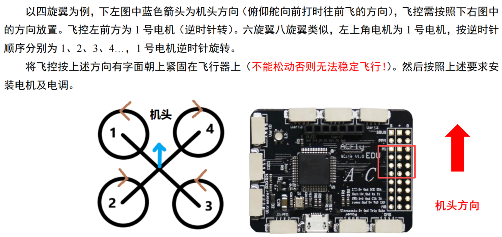
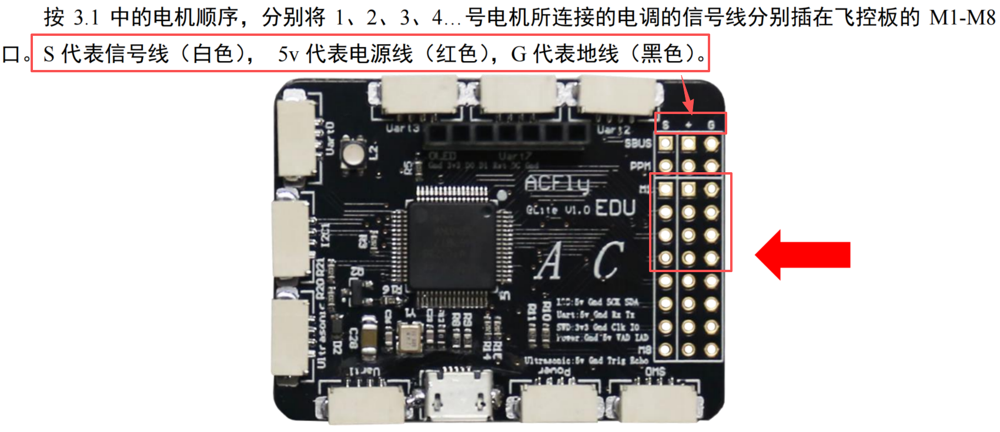
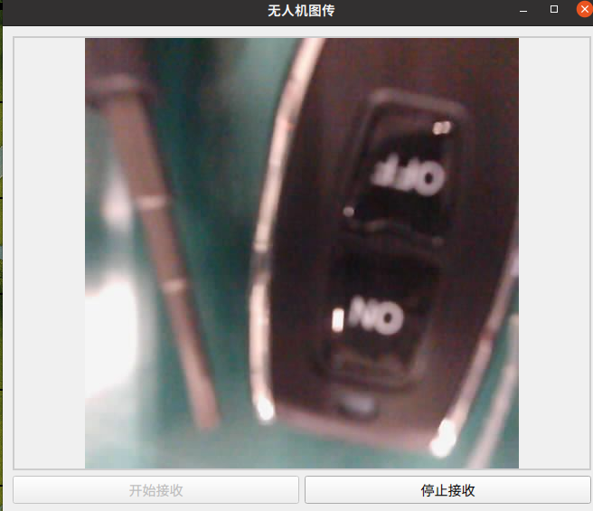
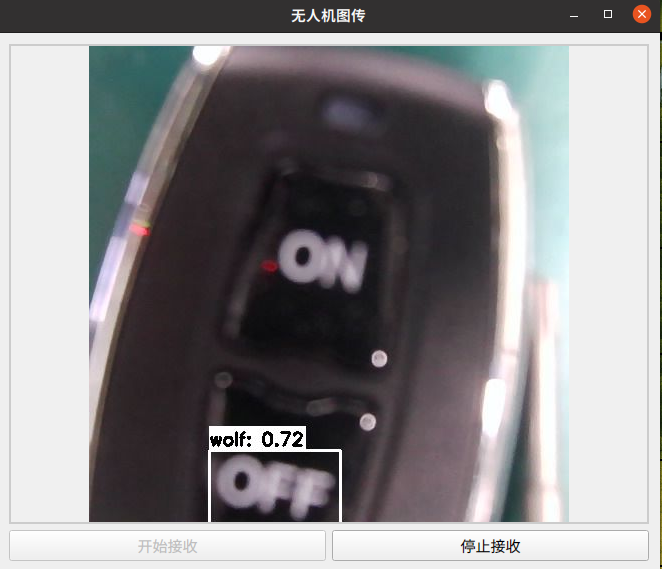

- [ ] 串口均为 57600，除了 激光定高模块


## 香橙派拓展版接线


V   G   R   T
绿  黄  黑  红


| 用户组  | 序号  | GPIO     | 复用         | 功能描述    | chip | channel |
| ---- | --- | -------- | ---------- | ------- | ---- | ------- |
| pwm  | 138 | GPIO4_B2 | PWM14_M1   | 舵机1     | 1    | 0       |
| pwm  | 28  | GPIO0_D4 | PWM3_IR_M0 | 舵机2     | 3    | 0       |
| gpio | 54  | GPIO1_C6 |            | 激光笔  开关 |      |         |
| gpio | 35  | GPIO1_A3 |            | 激光笔  开关 |      |         |

```
        # 上舵机 0-90右 90-180左

        self.pwm_servo_chip_up = 1

        self.pwm_servo_channel_up = 0

        self.pwm_servo_frequency_up = 50

        self.pwm_servo_init_up = 89

        # 下舵机 0-90下 90-180上

        self.pwm_servo_chip_down = 3    

        self.pwm_servo_channel_down = 0

        self.pwm_servo_frequency_down = 50

        self.pwm_servo_init_down = 92
```
 


---


## 飞控板接线





- [ ] 白色箭头前，留两排空余，依次插上四个电调控制线


- [ ] 串口线： 黑接 uart7、红接uart2


## 摄像头

 
本机

旋转180°！！！ 并非反转！

原版

