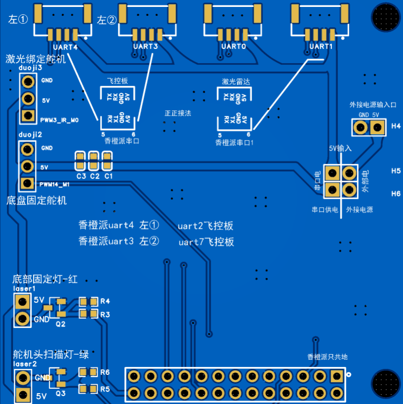
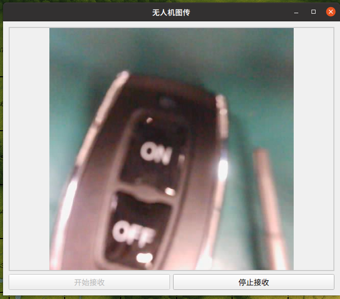

- [ ] 串口均为 57600，除了 激光定高模块


| 用户组  | 序号  | GPIO     | 复用         | 功能描述              | chip | channel |
| ---- | --- | -------- | ---------- | ----------------- | ---- | ------- |
| pwm  | 138 | GPIO4_B2 | PWM14_M1   | 舵机1<br>地盘固定       | 1    | 0       |
| pwm  | 28  | GPIO0_D4 | PWM3_IR_M0 | 舵机2<br>绑激光笔-绿     | 3    | 0       |
| gpio | 54  | GPIO1_C6 |            | 激光笔-红 <br>固定位  定位 |      |         |
| gpio | 35  | GPIO1_A3 |            | 激光笔 -绿<br>舵机头  扫描 |      |         |


| 功能                                                        | 飞行站Linux | 飞控板MCU | 功能                                                        |
| --------------------------------------------------------- | -------: | ------ | --------------------------------------------------------- |
| 1.起飞指令（t265就绪信息）<br>2.飞行位置（t265坐标信息）                      |    uart3 | uart7  | 1.t265就绪信息接收，起飞信号<br>2.t265坐标信息接收                         |
| 1. 发送 路径规划信息<br>2. 发送 飞向动物点指令<br>3. 发送 飞回路径指令<br>4. 发送 降落 |    uart4 | uart2  | 1. 接收 路径规划<br>2. 接收 飞向动物点指令<br>3. 接收 飞回路径指令<br>4. 接收 降落指令 |

## 香橙派拓展版接线


V   G   R   T
绿  黄  黑  红


## PCB接口总览



## 飞控板接线


- [ ] 白色箭头前，留两排空余，依次插上四个电调控制线


- [ ] 串口线： 黑接 uart7、红接uart2


## 摄像头

本机
 

旋转180°！！！ 并非反转！

原版

```python
pipeline = (
    "v4l2src device=/dev/video0 ! "   
    "image/jpeg, width=640, height=480, framerate=30/1 ! "  
    "jpegdec ! "   
    "videoconvert ! "  
    "videoflip method=rotate-180 ! "
    "appsink"  
)
```

修正后：


```python
pipeline = (
    "v4l2src device=/dev/video0 ! "   
    "image/jpeg, width=640, height=480, framerate=30/1 ! "  
    "jpegdec ! "   
    "videoconvert ! "  
    "videoflip method=rotate-180 ! " #  rotate-180
    "appsink"  
)
```

