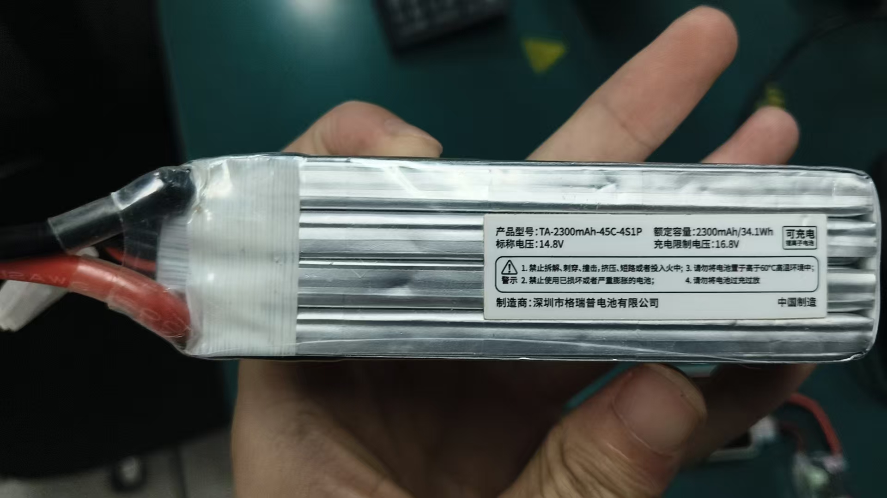
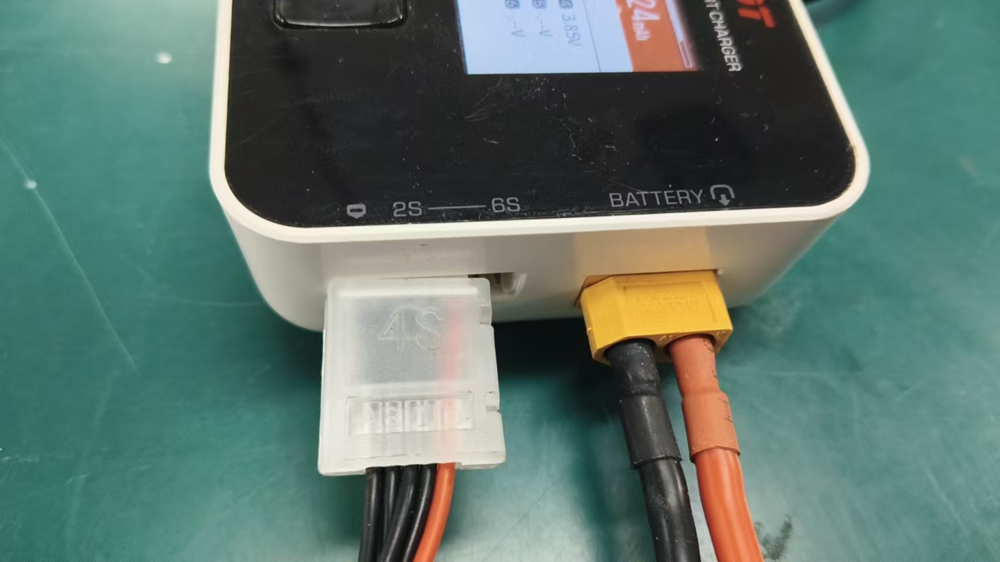
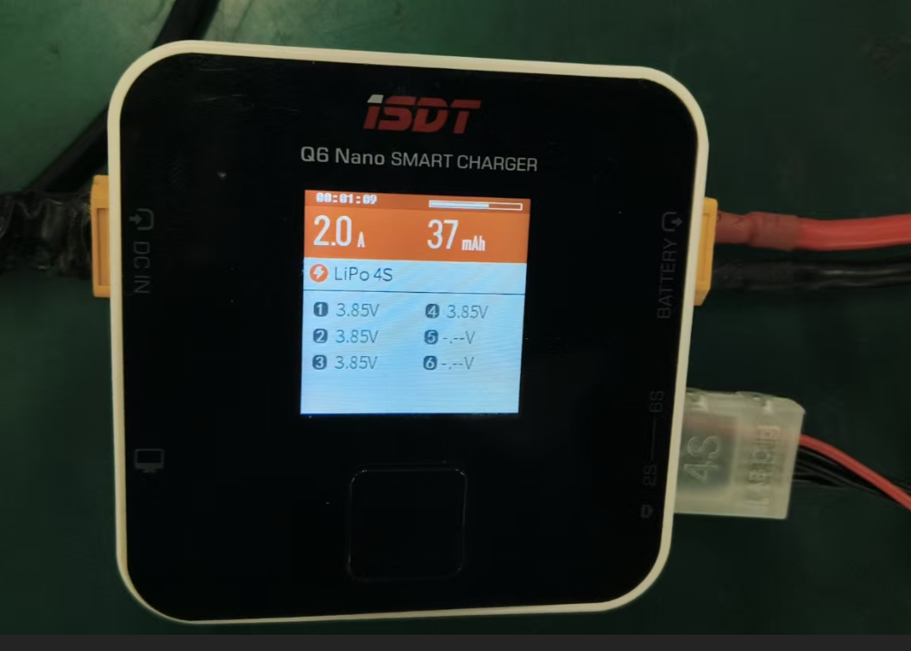

## 充电器 Q6 nano说明书
[Q6 nano说明书](https://www.isdt.co/down/pdf/Q6nano_CN.pdf)：https://www.isdt.co/down/pdf/Q6nano_CN.pdf

#### 电池型号

### 充电器使用截图

#### 任务设置 4.20V, 3.0A或2.0A
> 建议2.0A， 电流过大会发热;
> 充电时，一定要有人看守，避免电池

> 说明： 
> + 左侧为充电器接的电源插头梆子， 
> + 右侧为电池接的插头梆子，
> + 右上为电池充电接口，右下为电池电压检测接口，红线在上，不要反接。

